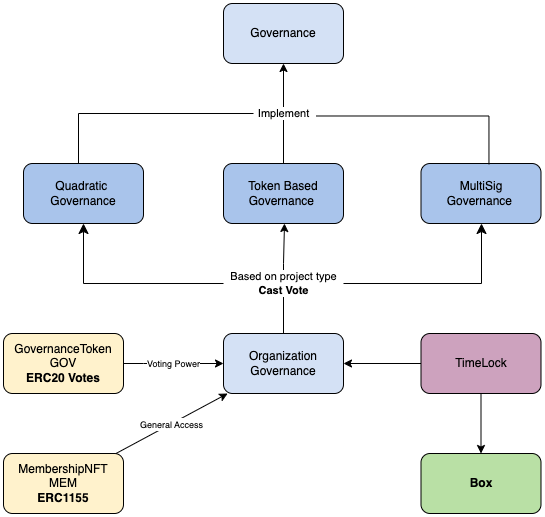
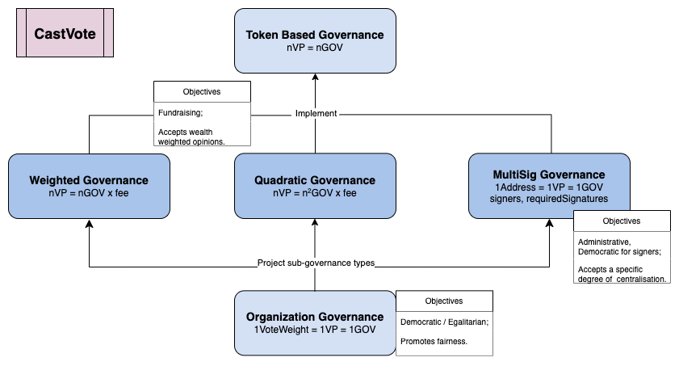

# InfraDAO - DAO system for Infrastructure teams

Smart contract repository for InfraDAO.

## Implementation tech stack:

- [OpenZeppelin](https://docs.openzeppelin.com/contracts/4.x/) contracts
- [Proxy Upgradeable Pattern](https://docs.openzeppelin.com/upgrades-plugins/1.x/proxies) for enhancing modularity
- [Hardhat](https://hardhat.org/) development environment
- [Ethers](https://docs.ethers.io/v5/) library
- [Waffle](https://ethereum-waffle.readthedocs.io/en/latest/) testing framework
- [Sepolia](https://sepolia.etherscan.io/) for gas analysis and deployments

## Contract Architecture



## Cast Vote Possibilities



## Usage

### Pre-requisites

- Git installed: run `git --version` to check
- NodeJS installed: run `node --version` to check
- Yarn installed: run `yarn --version` (or npm `npm --version`)

### Setup

#### Clone the repo: `git clone ...`

#### Install dependencies

```bash
yarn install
```

#### Compile contracts

```bash
yarn hardhat compile
```

#### Run tests and get gas report

```bash
yarn hardhat test
REPORT_GAS=true yarn hardhat test 
```

#### Testnet Gas Reports
Go on the following links and set-up: 
1. [Sepolia project](https://dashboard.alchemy.com/) following these steps: 
    - Click Create App
    - Select Chain: Ethereum, Network: Sepolia
    - Click on the projects details
    - Click on the `View Key` button
    - Copy the HTTPS RPC URL and add it to `.env` file as `SEPOLIA_RPC_URL`
    - Copy the MetaMask private key of your test account following [these instructions](https://support.metamask.io/hc/en-us/articles/360015289632-How-to-Export-an-Account-Private-Key)
    - Save the copied key on `.env` file as `PRIVATE_KEY`
2. [Coinmarketcap API key](https://coinmarketcap.com/api)
    - Create an account
    - Go on `Account` section
    - Click on `API Keys`, this will copy the private API key on your clipboard
    - Save the copied key on `.env` file as `COINMARKETCAP_API_KEY`

Create `.env` file in root directory and add the following variables
```
SEPOLIA_RPC_URL
PRIVATE_KEY
COINMARKETCAP_API_KEY
```

Go on `hardhat.config.ts` in `gasReporter` section and customise the following variables:
```
gasReporter: {
    ... 
    outputFile: 'gas-report.txt', //name of the file where the report will be saved
    token: 'ETH', // token used for gas price calculation
    currency: 'EUR', // currency used for gas price calculation
}
```

Then, simply run `yarn hardhat test` and the report will be saved in the file specified in `outputFile` variable.


#### Get test coverage

```bash
yarn hardhat coverage
```

#### Run local node

```bash
yarn hardhat node
```

#### Deploy contracts to local node
The following scripts, deploy the master contracts and the sub-dao contracts. 

For demonstration purposes, the last 3 scripts are used to prove the following:
 - An organization DAO is deployed, along with the registration of its sub-governance modules. 
 - The `setup-governor`script will allow only the governance contract to queue and execute proposals. 
 - Finally, a sub-dao is deployed and registered to the organization.

In the following order:

```bash
 yarn hardhat run scripts/deploy-governance-token.ts --network localhost

 yarn hardhat run scripts/deploy-membership-nft.ts --network localhost

 yarn hardhat run scripts/deploy-timelock.ts --network localhost

 yarn hardhat run scripts/deploy-organization-governance.ts --network localhost

 yarn hardhat run scripts/deploy-box.ts --network localhost

 yarn hardhat run scripts/deploy-all-governance-contracts.ts --network localhost

 yarn hardhat run scripts/deploy-dao-factory.ts --network localhost

 yarn hardhat run scripts/deploy-org-dao.ts --network localhost

 yarn hardhat run scripts/setup-governor.ts --network localhost

 yarn hardhat run scripts/deploy-sub-dao.ts --network localhost
```

Contract addresses will be registered in `./deployments.json`

#### Interact with contracts:

```bash
yarn hardhat run scripts/add-first-member.ts --network localhost
yarn hardhat run scripts/propose.ts --network localhost
yarn hardhat run scripts/vote.ts --network localhost
yarn hardhat run scripts/queue-and-execute.ts --network localhost
```

### PLAN:

1. Smart contracts 
2. Hardhat deployment scripts 
3. Write scripts to interact with them 
4. Write tests for hardhat 
5. Integrate with Sepolia network and perform gas analysis
6. Deploy to Sepolia network (Future work)