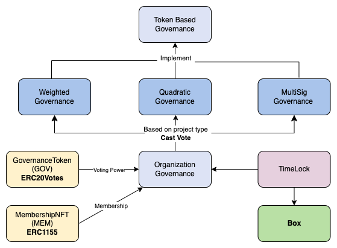

# InfraDAO - DAO system for Infrastructure teams

Smart contract repository for InfraDAO.

## Implementation tech stack:

- [OpenZeppelin](https://docs.openzeppelin.com/contracts/4.x/) contracts
- [Proxy Upgradeable Pattern](https://docs.openzeppelin.com/upgrades-plugins/1.x/proxies) for enhancing modularity
- [Hardhat](https://hardhat.org/) development environment
- [Ethers](https://docs.ethers.io/v5/) library
- [Waffle](https://ethereum-waffle.readthedocs.io/en/latest/) testing framework
- TODO: [Etherscan](https://etherscan.io/) for contract verification
- TODO: [Sepolia](https://sepolia.etherscan.io/) for deployment

## Contract Architecture



## Cast Vote Possibilities


## Usage

### Pre-requisites

- Git installed: run `git --version` to check
- NodeJS installed: run `node --version` to check
- Yarn installed: run `yarn --version` (or npm `npm --version`)

### Setup

#### Clone the repo: `git clone ...`

#### Install dependencies:

```bash
yarn install
```

#### Compile contracts:

```bash
yarn hardhat compile
```

#### Run tests:

```bash
yarn hardhat test
REPORT_GAS=true yarn hardhat test
```

#### Get test coverage:

```bash
yarn hardhat coverage
```

#### Run local node:

```bash
yarn hardhat node
```

#### Deploy contracts to local node:

In the following order

```bash
 yarn hardhat run scripts/deploy-governance-token.ts --network localhost

 yarn hardhat run scripts/deploy-membership-nft.ts --network localhost

 yarn hardhat run scripts/deploy-timelock.ts --network localhost

 yarn hardhat run scripts/deploy-organization-governance.ts --network localhost

 yarn hardhat run scripts/setup-governor.ts --network localhost

 yarn hardhat run scripts/deploy-box.ts --network localhost

 yarn hardhat run scripts/deploy-sub-dao.ts --network localhost
```

Contract addresses will be registered in `./deployments.json`

#### Interact with contracts:

```bash
yarn hardhat run scripts/add-first-member.ts --network localhost
yarn hardhat run scripts/propose.ts --network localhost
yarn hardhat run scripts/vote.ts --network localhost
yarn hardhat run scripts/queue-and-execute.ts --network localhost
```

### PLAN:

1. Smart contracts - DONE
2. Hardhat deployment scripts - DONE
3. Write scripts to interact with them - ~DONE
4. Write tests for hardhat - DONE
5. Integrate with Sepolia network
6. Verify contracts on Etherscan
